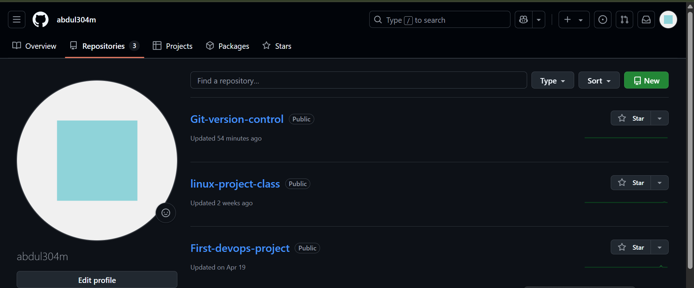
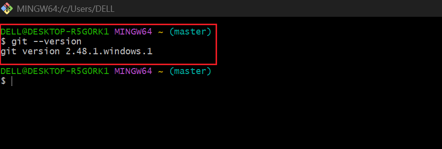
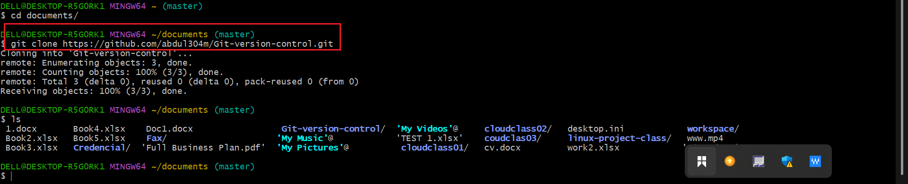
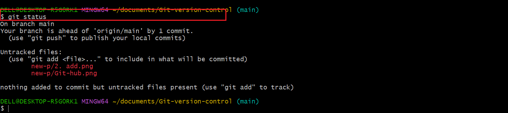
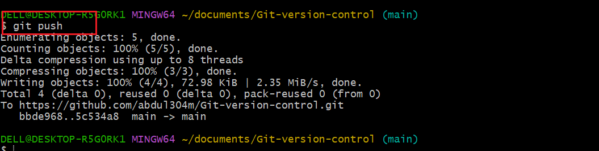

# Git-version-control 
In this project we walk through the basic git command workflow. Most git command moves files between these lacotions.

## 1. Github.

the first step to use git properly is by creating a remote repository, which serve as a server for sharing and backing up code.

## 2. Git version

the next thing is to verify the installation of Git by running the commnad "git --version"

## 3. Git clone.

The next step is git clone an existing repository, so you could have a local version project to work on, complete with all its history. you could do this by running this command Git clone and then paste the copy of the repository URL. " git clone https://github.com/abdul304m/Git-version-control.git

.

## 3. Git add & Git commit.

the next step is git add and git commit, you use git git add to prepare a set of changes for commit and git commit take a snapshot of the staging area and save it to local repository.

## 4. Git status.

Git status command is used to check what files are yet to be staged and committed. it is used to show the state of the working directory and staging area.

## 5. Git push.

Your code does'nt just stay on your lacal machine. when you are ready to share your progress with the team or back up your work, you use git push to send your commit to the remote repository.

## Github repository URL

 i created a repository with an index.html file at its root.

 https://github.com/abdul304m/Git-version-control/blob/main/index.html

 
Here are some of the git commands use to to move files between these four locations: the working directory, the staging area, the local repository and the remote repository.